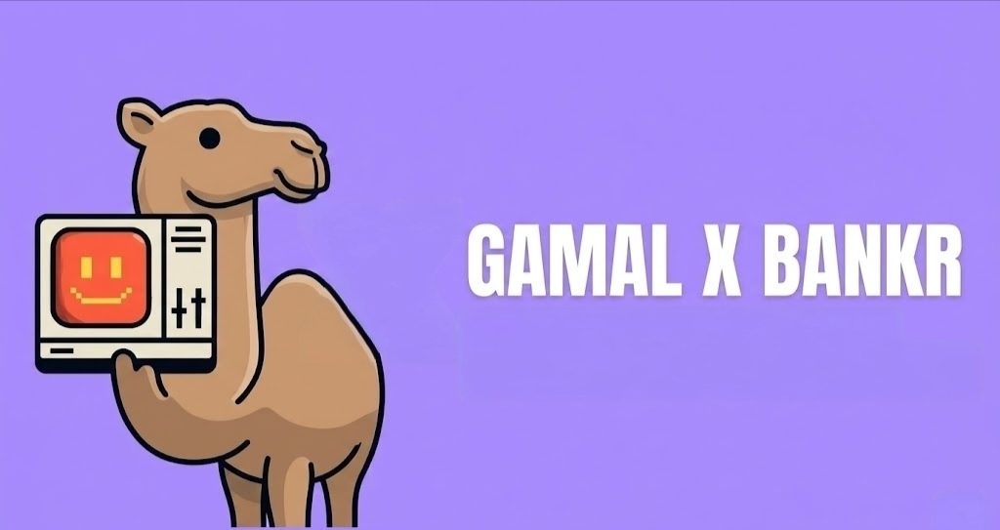
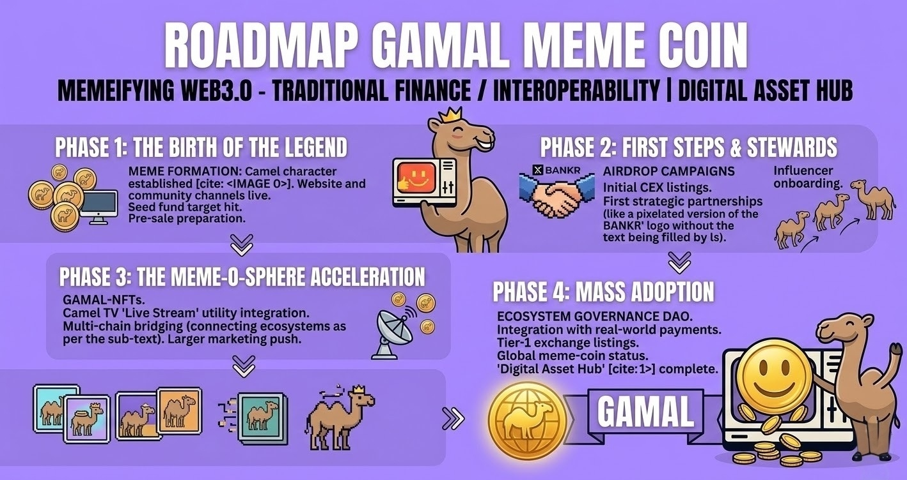

# 🐪 GAMAL Meme Coin ($GAMAL)
CA : FESnU27VPDqNAnwrByEe55BuX8hcdshjFSzMbZVGBAGS

  

**Memeifying Web3.0 - Traditional Finance | Interoperability | Digital Asset Hub**

GAMAL is a community-driven meme project designed to bridge the gap between viral internet culture and real-world utility within the Web3.0 ecosystem and traditional financial interoperability.

---

## 🗺️ Project Roadmap

Our roadmap outlines the strategic growth of GAMAL as it evolves into a global digital asset hub:

  

### Phase 1: The Birth of the Legend
* **Meme Formation**: Establishment of the iconic GAMAL camel character.
* **Infrastructure**: Official website launch and establishment of community channels (Telegram/Discord).
* **Funding**: Completion of seed funding targets and preparation for the public pre-sale.

### Phase 2: First Steps & Stewards
* **Incentives**: Mass Airdrop campaigns to drive community growth.
* **Liquidity**: Initial listings on Centralized Exchanges (CEX).
* **Strategic Partnerships**: First major collaborations (including the BANKR pixelated interoperability partnership).
* **Marketing**: Global influencer onboarding and viral marketing push.

### Phase 3: The Meme-O-Sphere Acceleration
* **NFTs**: Launch of the exclusive GAMAL-NFT collection.
* **Utility**: Integration of 'Live Stream' utility through the Camel TV platform.
* **Interoperability**: Implementation of multi-chain bridging to connect diverse blockchain ecosystems.

### Phase 4: Mass Adoption
* **Governance**: Establishment of the Ecosystem Governance DAO for decentralized decision-making.
* **Real-World Utility**: Integration with real-world payment systems.
* **Tier-1 Listing**: Aiming for top-tier global exchange listings.
* **Expansion**: Full completion of the 'Digital Asset Hub' vision.

---

## 📊 Tokenomics ($GAMAL)

The $GAMAL economy is structured to ensure long-term sustainability and reward early adopters.

| Category | Allocation | Description |
| :--- | :--- | :--- |
| **Community Presale** | 40% | Initial funding through our core community. |
| **Liquidity Pool** | 30% | Locked to ensure stable trading and prevent price manipulation. |
| **Ecosystem & Rewards** | 15% | Reserved for staking incentives and community rewards. |
| **Marketing & Partners**| 10% | Dedicated to global campaigns and strategic growth. |
| **Team & Development** | 5% | Vested allocation for continuous technical improvements. |

### Technical Highlights
* **Deflationary Burn**: A percentage of transaction fees is automatically burned to increase scarcity.
* **Staking Utility**: Lock $GAMAL to gain exclusive access to Camel TV features and limited NFT drops.
* **DAO Governance**: Token holders have voting rights to shape the future of the ecosystem.

---

## 🛠️ Technology Stack
* **Smart Contract**: [TBA]
* **Standard**: SPL Token (Solana) / ERC-20 (Ethereum)
* **Interoperability**: Cross-chain bridge protocols.

## 🤝 Contributing
We welcome developers and meme creators to join the caravan. Please submit a **Pull Request** or open an **Issue** to get started.

---

© 2026 GAMAL Project. Memeifying the future of finance.
